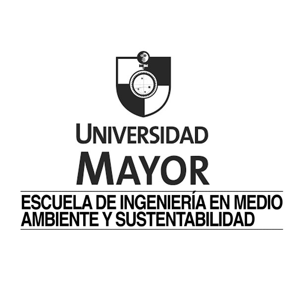

{width=10%}
{width=30%}

## Reseña

En este repositorio se pone a disposición de los alumnos de la carrera de `Ingeniería en Medio Ambiente` de la Universidad Mayor, las clases, laboratorios y material que se utilizará en la asignatura de `Introducción a la Tecnología de Información Geográfica`. Este repositorio está creado con [quarto](https://quarto.org/) por medio del software `R`.

## Clases

1. 15 marzo 2023. [Presentación curso](clase1/01_intro_curso.html)
2. 15 marzo 2023.  [Introducción a los SIG](clase1/02_intro_SIG.html)
3. 15 marzo 2023.  [Introducción a QGIS](clase1/03_intro_qgis.html)\

## Software SIG

1. [QGIS](http://www.qgis.org)

## Videos tutoriales

1. [Instalación de QGIS](https://www.youtube.com/watch?v=MtaQXPQSwC4&t=38s)

## Referencias bibliográficas

1. [Una ligera introducción a SIG](https://docs.qgis.org/3.16/es/docs/gentle_gis_introduction/index.html)
2. [Guia de usuario de QGIS](https://docs.qgis.org/3.16/es/docs/user_manual/)
3. [Sístemas de Informacíon Geográfica](http://volaya.github.io/libro-sig/). Victor Olaya. 

