```{r setup, include=FALSE}
options(htmltools.dir.version = FALSE)

library(mapview)
library(leaflet)
library(magrittr)
library(xaringanthemer)
style_mono_light(title_slide_background_color = 'grey',
           background_image = 'img/logo_hemera.png',
           background_size = '10%',
           background_position = '95% 5%',
           code_inline_color = 'red',
           code_font_google =  google_font("Work Sans", "300", "300i"),
           link_color = 'darkred' )
```

# ¿Qué es un análisis geoespacial?

- Es la aplicación de operaciones para manipular o calcular
coordenadas y/o atributos de datos relacionados.

- Aplicados para resolver problemas como:

  - Ruta de buses
  
  - Zonas de inundación
  
  - Determinación de un sitio adecuado
  
- El análisis espacial utiliza `operaciones espaciales` para manipular y calcular.

- `AEsD`: se utilizará para referirse a análisis espacial por el resto de esta clase.

---
# Ejemplo de AEsD

Delimitación de cuenca.

.center[
  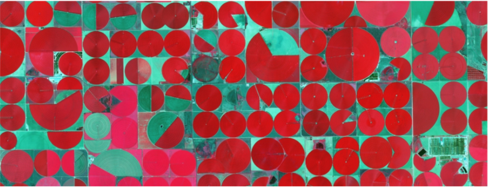
]

---
# Input, Operación y Output

- `AEsD` generalmente usa datos de 1 o más capas para crear un output (salida)

  - Uno a uno
  - Uno a muchos
  - Muchos a uno
  - Muchos a muchos
  
- El output no necesariamente debe ser espacial

  - Estadísticas
  
  - Reporte/Informe
  
---
# 7 técnicas de análisis geoespacial

- Selección

- Buffering

- Dissolve (disolver)

- Operaciones de overlay (superposición)

- Claisificación

- Operaciones con tablas

- Geocodificación

---
# Selección

- Las `operaciones de selección` identifican objetos que cumplen ciertas condiciones.

- Las condiciones de selección pueden ser `espaciales` o `no espaciales`

  - Selección basada en atributos (no espacial)
  
  - Selección basada en posición.
  
---
# Métodos de selección

- Dos tipos de métodos de selección disponibles

  - En pantalla/manual
  
    - El usuario selecciona los datos
    
  - Automático
  
    - El usuario/script define condiciones para que el computador seleccione los datos.
    
---
class: center, middle

# Selección no espacial

---

## Consulta de tabla de atributos

- Consulta de tabla es una operación SIG no espacial muy común.

- Selecciona una submuestra de los registros basado en valores específicos de atributos.

- Utiliza `operaciones algebraicas` y `operadores booleanos`

---
# Operaciones algebraicas

- Operaciones:

  - Menor que `<`
  
  - Mayor que `>`
  
  - Igual que `=`
  
  - No igual a `<>`
  
- mayor que y menor que no se pueden aplicar a atributos nominales

  - ¿Por qué?

- se pueden aplicar solos o en combinación  
---
# Ejemplo

Datos de riego censo agropecuario 2007 (IDE Minagri)

- Superficie de riego mayor a 1000 ha

  - Expresión:  "sup_riego" >1000

- Superficie de riego goteo menor a 10 ha

  - Expresión:   "goteo" <10

- Todos los distritos que se encuentran en la región Metropolitana

  - Expresión:  "nom_reg"  =  'Región Metropolitana de Santiago' 
  
- Todos los distritos que NO se encuentran en la región Metropolitana

  - Espresión:  "nom_reg"  <>  'Región Metropolitana de Santiago' 
  
---
# Algebra booleana

- Utiliza condiciones `OR`, `AND` o `NOT`

- La evaluación se hace asignando a la salida un valor de verdadero (TRUE) o falso (FALSE), a cada condición.

- El orden de las operaciones no importa

---
# Operadores y tablas de verdad

.center[
  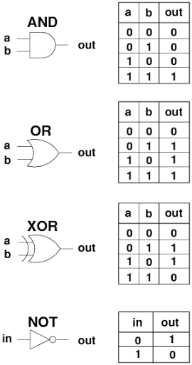
]

---
# Operadores y tablas de verdad


.center[
    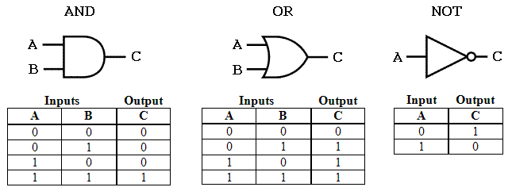
]

---
# ¿Cuál es el resultado?

- NOT (F)

- V AND V

- F OR NOT(V)

- V OR (F OR (V AND V))

- (V AND V) OR F AND (NOT(F) AND V)

---
# ¿Cuál es el resultado?

- NOT (F) --> **V**

- V AND V --> **V**

- F OR NOT(V) -> **F**

- V OR (F OR (V AND V)) --> **V**

- (V AND V) OR F AND (NOT(F) AND V) --> **V**

---
#Ejemplo

Riego Censo agropecuario 2007

- Superificie de riego por goteo distinta de 0 y que perteneza a la región de O'Higgins

  -  ("goteo" <>0) AND  ("nom_reg"  =  'Región del Libertador General Bernardo O''Higgins' )
  
- ¿Qué pasa si cambio el AND por un OR?

  -  -  ("goteo" <>0) OR  ("nom_reg"  =  'Región del Libertador General Bernardo O''Higgins' )
  
- Si quiero seleccionar todos los distritos con superficie de riego total a 500 ha o  que tengan superficie por goteo mayor a 100 ha y que estén en la región del Maule.

--
  - ( "sup_riego" > 500 OR  "goteo" >100) AND  "nom_reg"  =  'Región del Maule' 
  
  
---
class: center, middle

# Selección Espacial

---
# Ejemplo


---
#Operaciones espaciales de selección

- `Adjacentes` identifica objetos que comparte un segmento de borde

- `Intersecta` identifica objetos que pasan sobre otro

- `Contiene` identifica objetos que contienen a otros o estan conmtenidos por otros objetos

- `Distancia` identifca los objetos que estan a una cierta distancia de otros objetos

---
class: center, middle

# Buffering y Dissolve

---

# Buffering

- `Buffers` son regiones que estan a menos de o igual a una distancia desde uno o varios objetos.

  - Los buffers se pueden crear desde puntos, lineas, poligonos, o raster.
  
- Los `buffers` son tipicamente usados para identificar areas o objetos que están `dentro` o `fuera` desde la distancia umbral.

  - ¿Ejemplos de usos de buffer?

---
# Buffering

.center[
    
]

---
# Buffering

.center[
    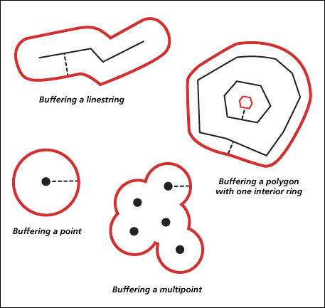
]

---
# Ejemplo en QGIS

- seleccionar un distrito

- crear puntos aleatorios y centroide

- crear buffer para los puntos y para el distrito

---
# Dissolve

- `Dissolve` combina objetos similares dentro de una capa basado en atributos

.center[
    
]

---
# Ejemplo QGIS

- Disolver distritos seleccionados 

---
class: center, middle

# Operaciones de superposición

---
# Operaciones de superposición

- Consideran la combinación de datos y atributos espaciales de dos o más capas espaciales. 

  - Muy poderosa y popular aplicación
  
  - ¿Ejemplos de superposición?
  
- Superposición requiere que los datos esten en el mismo sistema de coordenadas

---
# Superposición vectorial

- Considera combinar gemoetrias de tipo punto, linea, poligono y sus atributos.

  - La superposición crea nuevas geometrías.
  
- El resultado puede generar grandes tablas de atributos si la operación de superposición combina muchas capas.

  - el duplicado de atributos también puede suceder
  
---
# Casos básicos de superposición - Cortar

- `Cortar` define el área de salida del objeto espacial basado en un póligono `cortado`

- Los atributos de la capa de corte no son pasados al objeto cortado final, solo los del objeto de entrada.

.center[
    
]

---
# Casos básicos de superposición - Intersección

- Combina los datos de los dos objetos, pero solo para regiones en que ambos objetos se intersectan.

- Similar a `cortar` pero en este caso los atributos del `poligono` de corte son pasados al objeto de salida.

.center[
    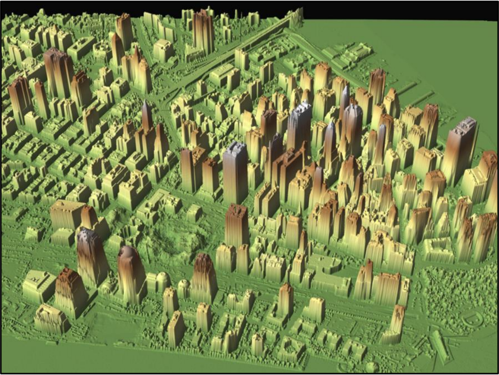
]

---
# Casos básicos de superposición - Unión

- `Unión` es una operación de superposición que incluye todos los datos de los dos objetos.

- No se descartan objetos espaciales en la unión y los atributos correspondientes son almacenados para todas las regiones.

.center[
    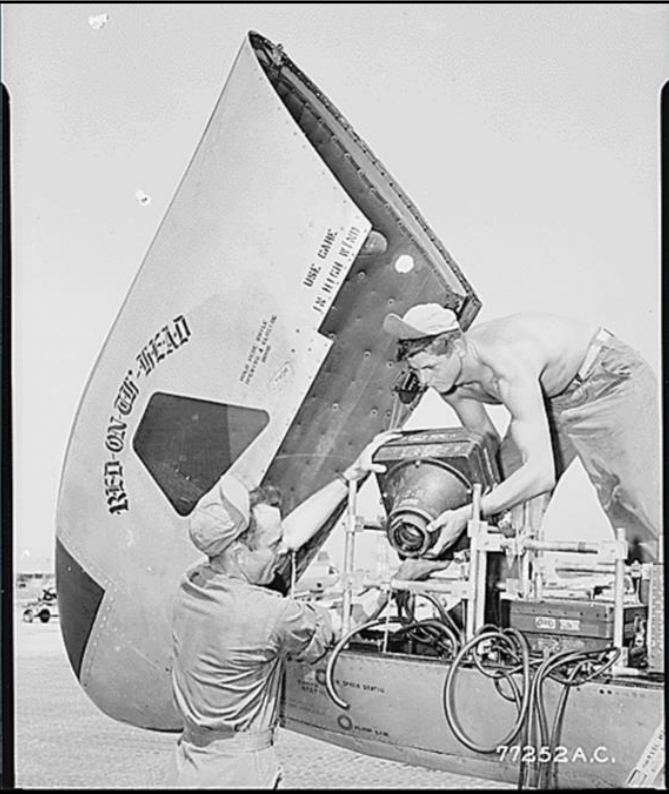
]

---
# Ejemplo QGIS

- Crear un poligono de ejemplo agregar alguna información de atibuto

- Cortar la capa de distritos censales con el polígono creado

- Unir la capa de distritos censales con el polígono creado

- Intersecatr la capa de distritos censales con el poligono creado

- Comparar las tablas de atributos

---
# Problemas de superposición vectorial

- Objetos de entrada representen entidades comunes que se representan en ambas capas, pueden tener una geometría ligeramente diferente.

- Esto crea `polígonos de astilla` cuando las operaciones de astilla son realizadas.

- Existen diferentes técnicas para reducir la ocurrencia de `polígonos de astilla`

---
# Ejemplo

.center[
    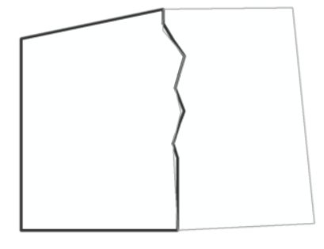
]

---
# Ejemplo

.center[
    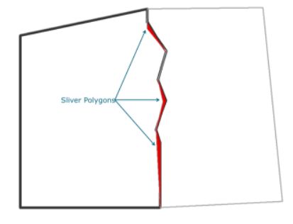
]

---
class: center, middle

# Operaciones con tablas

---
# Operaciones con tablas

- Combinar tablas de atributos es una poderosa herramienta de análisis

- Tres tipos comunes de operaciones con tablas:

  - Intersección
  
  - Unión
  
  - Juntar (Join)

---
# Operaciones con tablas - Intersección

.center[
    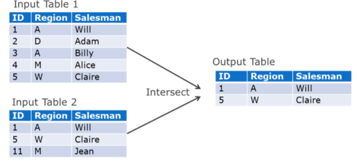
]

---
# Operaciones con tablas - Unión

.center[
    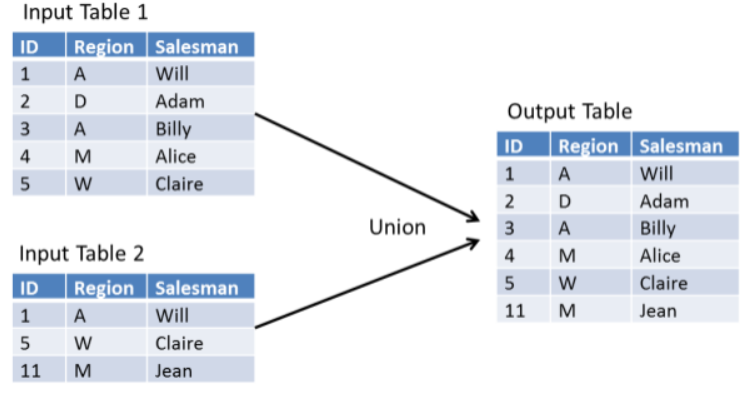
]

---
# Operaciones con tablas - Juntar

.center[
    
]

---
class: center, middle

# Geocodificación

---
# Geocodificación

- Es el proceso de referenciar objetos espacialmente de acuerdo a su dirección con su ubicación en la tierra.

- Dos tipos de geocodificación

  - Geocodifcación lineal
    
    - Asume que una dirección varia linealmente a través del objeto (linea)
    
  - Geocodificación de área
  
    - Asigna una localización geocodificada a un área (polígono)
    
---
# Geocodificación lineal

Ubiación estimada

¿Dónde queda el 180 Easy St?

$$\frac{180-100}{200-100} = .8 = 80%$$

Se encuentra al 80% del inicio

.center[
    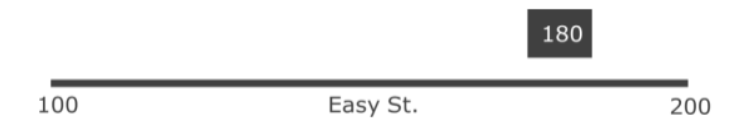
]

---
# Geocodificación de área

.center[
    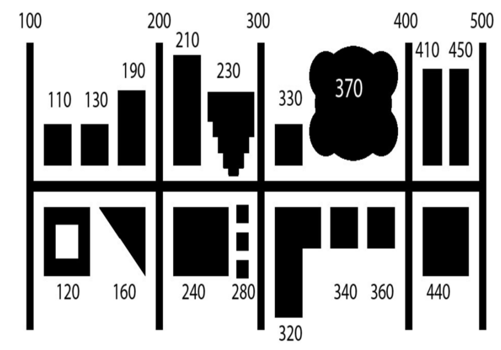
]

